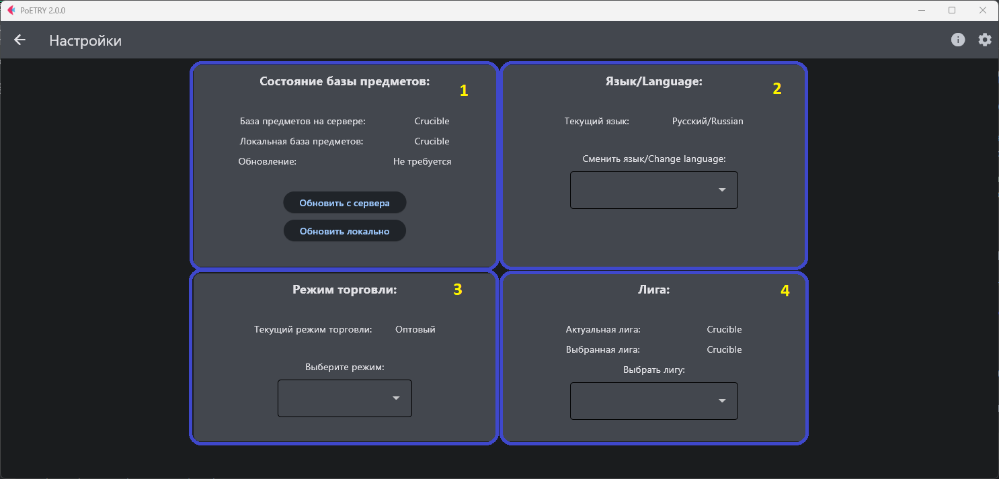

# PoETRY / Path of Exile Items Price Converter

Приложение для удобного расчёта оптимального соотношения цены предмета к сферам хаоса.

Приложение является обновлением и объединением двух предыдущих
версий: [PoE Currency Calculator](https://github.com/proDreams/PoE-Currency-Calculator)
и [PoE Trade About Parser](https://github.com/proDreams/PoE-Trade-About-Parser)

## Содержание

1. [Использование приложения](#Содержание)
2. [Требования](#Требования)
3. [Запуск приложения](#Запуск)
4. [Автор](#Автор)

## Использование приложения

### Первоначальная настройка:
1. Нажать на иконку шестерёнки в правом верхнем углу
2. В открывшемся окне:

   1. Информация о версии базы и возможность обновить базу с репозитория или локально
   2. Выбор языка. Для применения необходимо перезапустить программу
   3. Режим торговли. Оптовый(в зависимости от количества) или Штучный(получает первые  выданные результаты, без учёта количества)
   4. Выбор лиги. Отображение актуальной и выбранной лиги.

### Проверка цены:

1. В главном меню выбрать необходимую категорию предмета, допустим Валюта

2. В открывшемся меню со списком предметов из категории Валюта, выбираем необходимую, допустим Сфера перемен

3. В открывшемся поле необходимо ввести доступное количество, рекомендуется вводить не больше, чем помещается в инвентарь персонажа, допустим 1200 сфер

4. После нажатия на кнопку Применить, происходит расчёт цены и вывод результата

5. После вывода результата, необходимо нажать на кнопку Копировать и текст для вставки скопируется в буфер обмена
6. Переходим в игру. Наводим курсор на выбранный предмет и нажимаем правой кнопкой мыши

7. Вставляем в поле скопированную строку и нажимаем ОК


## Требования

Для работы программы требуются библиотеки: `selenium`, `requests`, `flet`, `webdriver-manager`, `PyYAML`, `pyperclip`

```commandline
pip install -r requirements.txt
```

## Запуск

### Версия из репозитория

1. Скачать и установить `python`
2. Скачать и распаковать архив
3. Открыть в распакованной папке терминал или PowerShell
4. Установить необходимые библиотеки `pip install -r requirements.txt`
5. Ввести `python main.py`
6. Пользоваться

### Самостоятельная версия

1. Скачать установочный файл
2. Установить программу
3. Запустить с ярлыка на рабочем столе
4. Пользоваться

## Автор

Иван "proDream" Ашихмин