# PoETRY

Приложение для удобного расчёта оптимального соотношения цены предмета к сферам хаоса.

Приложение является обновлением и объединением двух предыдущих
версий: [PoE Currency Calculator](https://github.com/proDreams/PoE-Currency-Calculator)
и [PoE Trade About Parser](https://github.com/proDreams/PoE-Trade-About-Parser)

## Содержание

1. [Использование приложения](#Содержание)
2. [Требования](#Требования)
3. [Запуск приложения](#Запуск)
4. [Автор](#Автор)

## Использование приложения

### Проверка цены:

1. Выбрать пункт "Проверка стоимости предметов":
   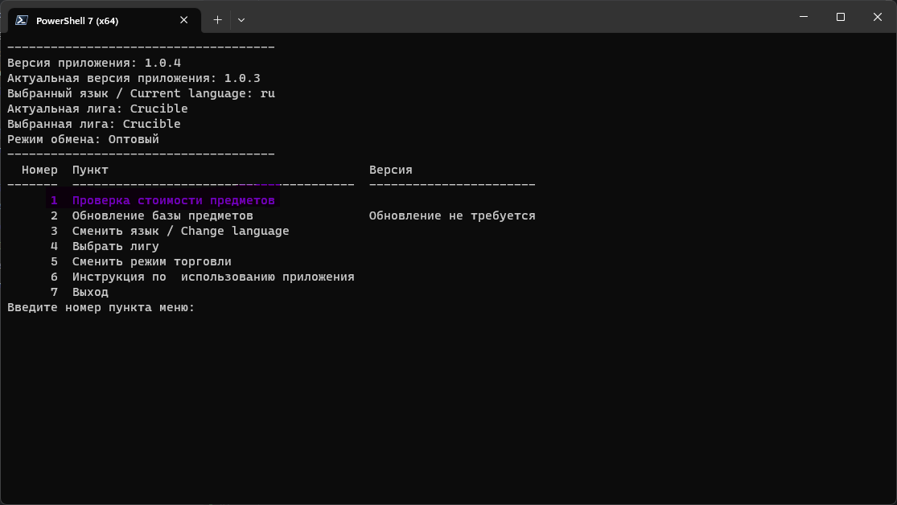
2. Выбрать категорию предмета, для примера "Валюта":
   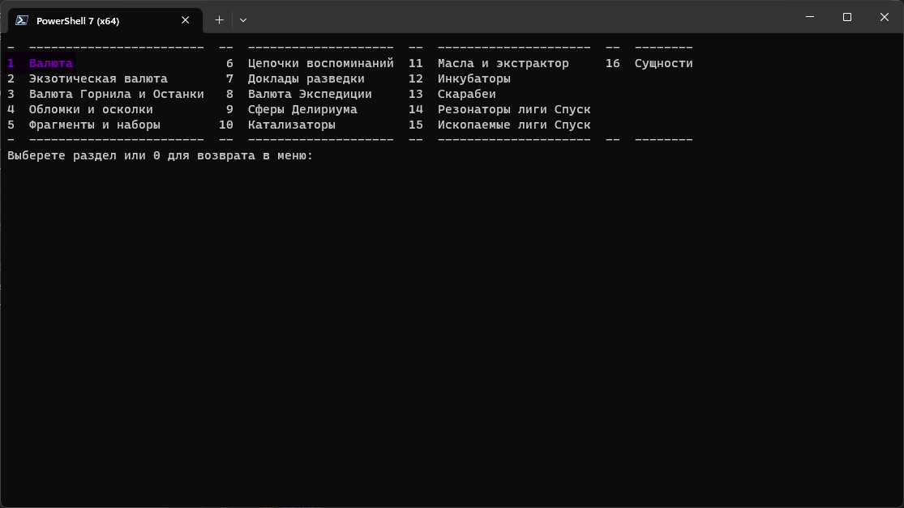
3. Выбрать необходимый предмет, для примера "Сфера перемен":
   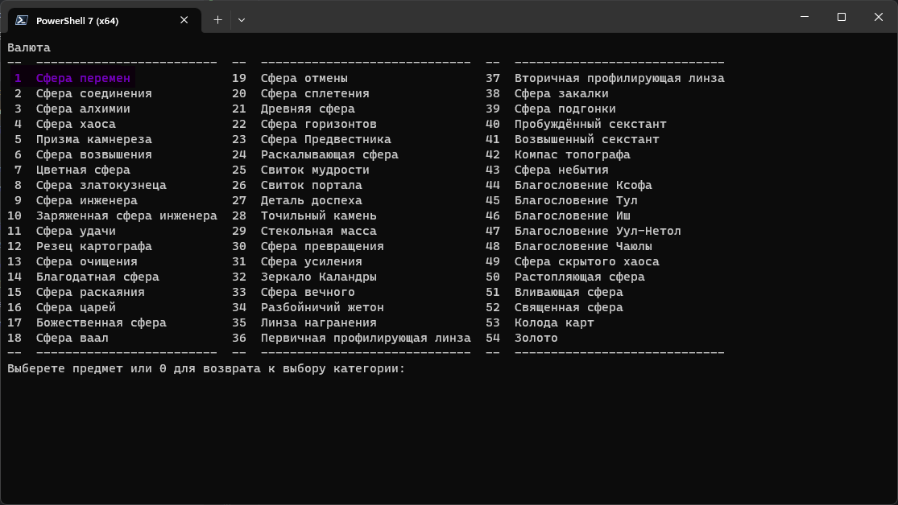
4. Ввести имеющееся количество, для примера 1000 штук:
   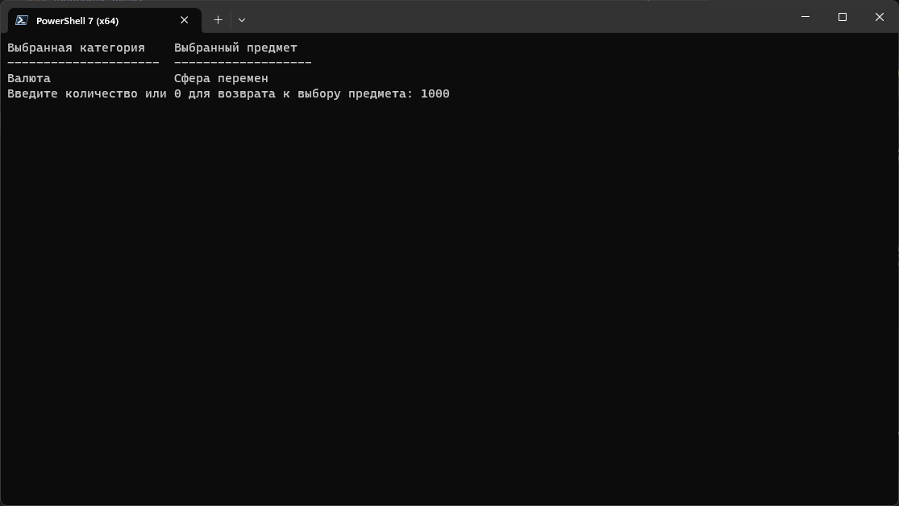
5. Будет выведен результат оценки. Необходимо скопировать строку для игры.
   (Для копирования, необходимо выделить строку и нажать правую кнопку мыши.)
   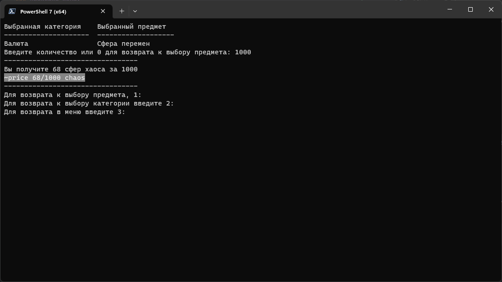
6. Переходим в игру и нажимает правой кнопкой мыши на предмете:
   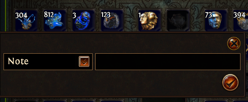
7. В открывшемся окне, сразу на пункте "Заметка" в поле ввода вставляем полученную в программе строку:
   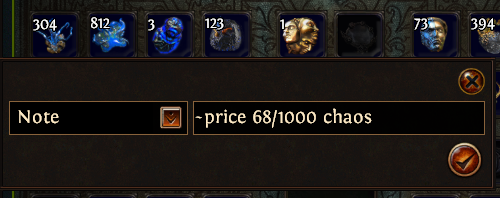
8. Нажимаем на галочку и ждём покупателей.

### Обновление базы предметов:

1. Выбрать пункт "Обновление базы предметов", обратите внимание на пометку о необходимости обновления!
   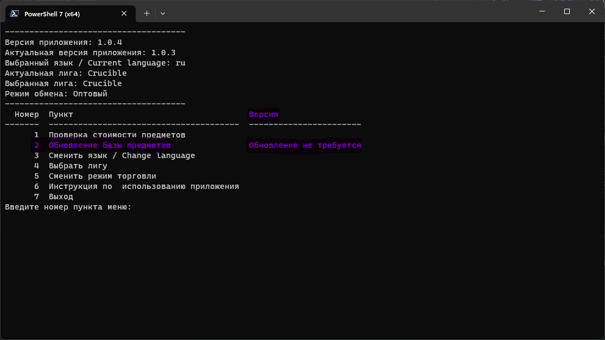
2. Если локальная версия не совпадает с версией на сервере, выбираем первый пункт "Обновить базу предметов с сервера":
   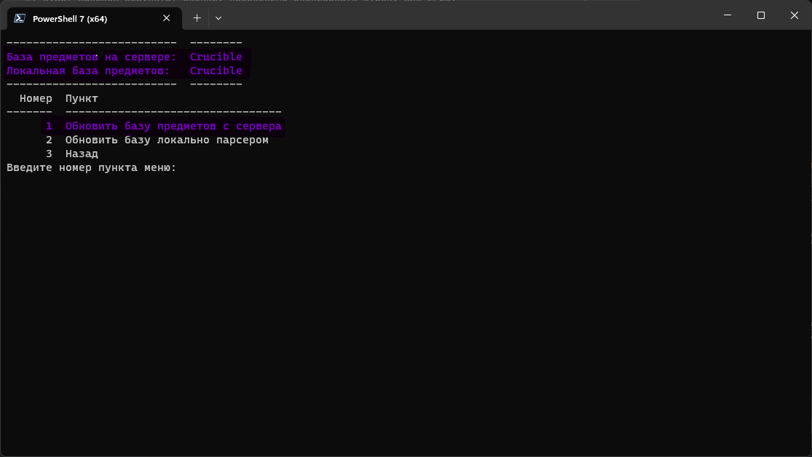
3. Дождаться обновления.
4. Если по какой-то причине, база на сервере устарела от актуальной лиги, выбираем пункт "Обновить базу локально
   парсером":
   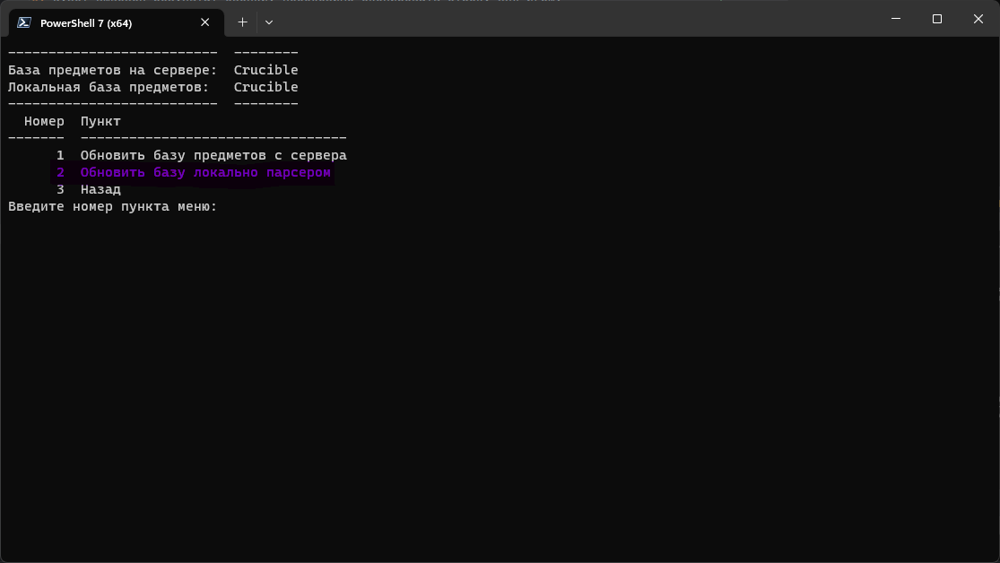
5. Для получения данных с торгового сайта, необходимо ввести ваш POESESSID:
   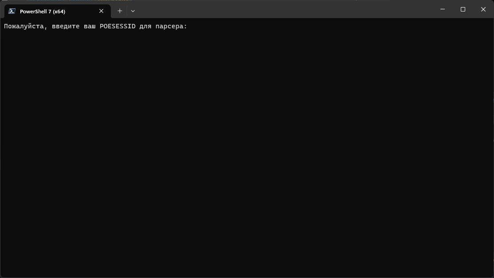
6. Дождаться обновления.

## Требования

Для работы программы требуются библиотеки: `selenium`, `requests`, `tabulate`, `webdriver-manager`, `PyYAML`

```commandline
pip install -r requirements.txt
```

## Запуск

### Версия из репозитория

1. Скачать и установить `python`
2. Скачать и распаковать архив
3. Открыть в распакованной папке терминал или PowerShell
4. Установить необходимые библиотеки `pip install -r requirements.txt`
5. Ввести `python main.py`
6. Пользоваться

### Самостоятельная версия

1. Скачать установочный файл
2. Установить программу
3. Запустить с ярлыка на рабочем столе
4. Пользоваться

## Автор

Иван "proDream" Ашихмин  
Поддержать: [Boosty](https://boosty.to/prodream/donate)